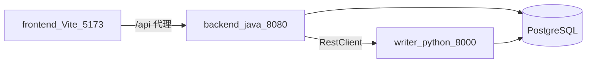

# MythosForge：Day 1–4 讲师串讲稿（初始框架跑通）

> 用途：对着镜子练讲解、面试前快速复盘、向同事白板演示时的提纲。  
> 踩坑与分层排查详见仓库根目录 **[问题.md](../问题.md)**。

---

## 一、开场（约 30～60 秒）

大家好，这个仓库 **MythosForge** 是一个 **本地优先** 的长篇小说创作引擎 **骨架**。当前 Day 1 到 Day 4，我们做的是「把路铺通」：**前端能走通业务流程**，**Java 负责对外 API 和业务编排以及大部分持久化**，**Python Writer 专门负责调用大模型、做多步 Agent、产出结构化 JSON**，**PostgreSQL 存项目和各种契约表**。

刻意 **没有** 做的是：真实爬虫、章节正文生成流水线、Qdrant / Neo4j / Redis Streams——这些在后续 Day 再increment。

接下来我按 **每一天交付了什么**、**每一层技术栈干什么**、**本地怎么联调** 三块来讲。

---

## 二、Day 1～4 分别交付了什么（各 1～2 分钟）

| 阶段 | 用户或自己能「看见」的能力 | 实现上记住一句话 |
|------|---------------------------|------------------|
| **Day 1** | 前端能启动；能 **创建项目** | Spring Boot 提供 REST；Flyway 建 **`projects`**；数据进 Postgres |
| **Day 2** | **项目列表**、**项目详情**；详情里能看到 **Writer 是否连通** | Java 用 **RestClient** 调 FastAPI 的 health/test；Flyway 补了一批 **契约相关空表** |
| **Day 3** | Writer 侧 **`POST /api/writer/test-agent`**；表里能看到 **`llm_usage_log`** | **LLM Gateway** 统一调模型；Prompt 从 **`prompts/*.md`** 读；**Pydantic** 校验 + **一次 JSON repair** |
| **Day 4** | 详情页填 **题材偏好**，拿到 **三个候选题材** 等结构化结果，并 **写入 `genre_decision_contracts`** | Python 里 **三个 Agent**（Scout → Strategist → Scorer）串行；Java **转发请求并保存** JSON |

讲解技巧：先说一句「用户能干什么」，再一句「背后是哪一层」，面试官能跟上。

---

## 三、总体架构（建议边画边讲）

核心事实只有三条：

1. **浏览器只访问前端端口（5173），并且只打相对路径 `/api`，不直接打 Python。**
2. **Java（8080）是对外的「业务门面」**：鉴权以后可以加在这里；现在没有鉴权。
3. **Writer（8000）是「智能服务」**：Java 用 HTTP 调它；它和 Java **共用同一个 Postgres** 写日志表。

可以用口语串：**「用户以为在和网页说话，其实是网页通过代理在和 Java 说话；Java 既要落库，又要问 Python 要智能结果。」**

---

## 四、Java 这一侧：定位与关键类（「每个类干嘛的」）

### 4.1 定位（讲师话术）

Java 在本项目里扮演四个角色：

- **HTTP API**：给浏览器 / 脚本用的 REST。
- **编排**：例如「先查项目有没有，再调 Writer，再把结果拆开写库」。
- **事务边界**：`@Transactional` 包在 Service 上，保证「调 Writer + 写库」的一致性策略（当前是「Writer 成功再 commit」这类朴素逻辑）。
- **ORM 持久化**：Spring Data JPA + Flyway 管理的表结构。

口诀：**Controller 接请求，Service 写流程，Repository 访问数据库，Client 访问 Writer。**

### 4.2 按类/包点名（结合源码路径）

| 类 / 包 | 路径 | 讲什么 |
|---------|------|--------|
| 启动类 | `backend-java/src/main/java/com/mythosforge/MythosForgeApplication.java` | Spring Boot 入口 |
| CORS | `.../common/WebConfig.java` | 允许 `localhost:5173` 调 `/api/**`，否则浏览器跨域被拦 |
| 健康检查 | `.../common/HealthController.java` | Java 进程自身是否活着（与 Writer health 不同） |
| 项目实体 | `.../project/Project.java` | 对应表 **`projects`** |
| 项目仓储 | `.../project/ProjectRepository.java` | JPA `findAll` / `findById` / `save` |
| 项目 API | `.../project/ProjectController.java` | `GET/POST /api/projects`，`GET .../detail`（详情里拼 Writer 探测） |
| 项目业务 | `.../project/ProjectService.java` | 创建项目、列表、按 id 查 |
| 项目 DTO | `.../project/dto/*.java` | 请求/响应 JSON 形状；与前端 **camelCase** 对齐 |
| Writer 客户端 | `.../writer/WriterEngineClient.java` | **出站 HTTP**：`/api/writer/health`、`/test`、`/genre/recommend`；base URL 来自配置 |
| 题材 API | `.../genre/GenreController.java` | `POST /api/projects/{id}/genre/recommend` |
| 题材业务 | `.../genre/GenreService.java` | 组装请求体、调 Writer、解析 JSON、写 **`genre_decision_contracts`** |
| 题材实体 | `.../genre/GenreDecisionContract.java` | JSONB 列 + `raw_json` |
| 配置 | `backend-java/src/main/resources/application.yml` | 数据源、Flyway、`mythosforge.writer.base-url`、日志级别等 |

讲到 **WriterEngineClient** 时可以停顿一下：**「这是 Java 和 Python 的唯一 HTTP 耦合点之一，联调问题往往先看这里发出去的 URL、body、超时。」**

---

## 五、Python Writer：定位与关键模块

### 5.1 定位（讲师话术）

Writer 做三件事：

1. **暴露 FastAPI HTTP**，给 Java 调（也可以你本地 curl 直连调试）。
2. **所有大模型调用必须经过同一个 LLM Gateway**，顺便写 **`llm_usage_log`**。
3. **结构化**：用 **Pydantic** 约束输入输出；必要时 **repair 一次**。

口诀：**`api` 是门面，`agents` 是脑子里的多步推理，`services` 是基础设施（网关、Prompt、数据加载、落库），`schemas` 是契约。**

### 5.2 按文件点名

| 模块 | 路径 | 讲什么 |
|------|------|--------|
| 应用入口 | `writer-python/app/main.py` | 挂载路由；422 校验日志；genre 入站 **Content-Length** 等中间件 |
| 配置 | `writer-python/app/config.py` | 读 **`writer-python/.env`**：数据库、OpenAI 兼容 Key、模型名 |
| LLM 网关 | `writer-python/app/services/llm_gateway.py` | **唯一** Chat Completions；每次调用写日志 |
| 用量日志 | `writer-python/app/services/usage_log.py` | 插入 **`llm_usage_log`** |
| Prompt | `writer-python/app/services/prompt_registry.py` | 从 **`writer-python/prompts/*.md`** 读正文，避免提示词散落在代码里 |
| 静态数据 | `writer-python/app/services/genre_data.py` | 读 **`writer-python/data/**`** |
| Agent | `writer-python/app/agents/genre_scout.py` 等 | Day 4 三步流水线，每步都走 Gateway |
| Genre API | `writer-python/app/api/genre.py` | `POST /api/writer/genre/recommend` |
| Genre 契约 | `writer-python/app/schemas/genre.py` | 请求模型 vs 响应模型；响应 **camelCase** 给 Java |
| Repair | `writer-python/app/services/json_repair.py` | 输出 JSON 不合格时 **再调一次** 模型修格式 |
| 连通性 | `writer-python/app/api/test_agent.py` | Day 3 `test-agent` |

讲到 **Gateway** 时强调：**「面试可以说：后续所有 Agent 都收口到一个网关，便于计费、日志、换模型、审计。」**

---

## 六、前端：定位与关键文件

前端刻意做 **薄**：**不直连 Writer**，只调 Java，避免浏览器暴露 Key、也避免 CORS 配置蔓延。

| 文件 | 路径 | 讲什么 |
|------|------|--------|
| 代理 | `frontend/vite.config.ts` | `5173` 上 `/api` 转到 **`8080`** |
| HTTP 封装 | `frontend/src/api/client.ts` | `fetch` + JSON |
| 项目 API | `frontend/src/api/projects.ts` | 列表、创建、详情 |
| 题材 API | `frontend/src/api/genre.ts` | `POST .../genre/recommend` |
| 路由与页面 | `frontend/src/App.tsx`、`pages/*.tsx` | 列表、创建、详情（Writer 状态 + 题材表单） |

---

## 七、数据库与迁移（简短）

- **Flyway** 脚本在：`backend-java/src/main/resources/db/migration/`  
  - **V1**：`projects`  
  - **V2**：题材相关、章节相关等 **多张表**（Day 2 打底；Day 4 写入其中 **`genre_decision_contracts`**）
- **Java** 启动时跑迁移；**Python** 单独连同一个库写 **`llm_usage_log`**。

讲解时可提：**「结构迁移跟 Java 仓库走，运行期日志 Python 也会写——两边共用 Postgres。」**

---

## 八、本地联调怎么讲（面试高频路径）

按顺序说这五步即可：

1. **Docker**：`docker compose up -d`，至少 **Postgres** 起来。
2. **Writer**：`cd writer-python`，虚拟环境里 **`uvicorn app.main:app --host 0.0.0.0 --port 8000`**，配置 **`.env`**（API Key 等）。
3. **Java**：`cd backend-java`，**`mvn spring-boot:run`**，端口 **8080**，确认 **`mythosforge.writer.base-url`** 指向 Writer（例如 `http://127.0.0.1:8000`）。
4. **前端**：`cd frontend`，**`npm run dev`**，浏览器 **5173**，所有请求走 **`/api` 代理到 Java**。
5. **演示故事**：**创建项目 → 打开详情 → 看 Writer 探测 → 提交题材推荐 → 数据库里看 `genre_decision_contracts` 与 `llm_usage_log`。**

可选加分：提一句冒烟脚本 **`scripts/smoke-genre-recommend.ps1`**，用来对比「直连 Writer」和「经 Java」的差异。

---

## 九、收尾：从框架到工程思维（30 秒）

Day 1–4 的价值不是「功能多」，而是：

- **分层清晰**：谁对外、谁算智能、谁落库。
- **契约显式**：JSON 字段名、Pydantic、JPA JSONB。
- **可观测**：`llm_usage_log`、Spring `message`、Python 422 明细。

若面试官问「踩过什么坑」，直接引向 **[问题.md](../问题.md)** 里的分层：**HTTP 400 vs FastAPI 422**、**502 与上游包装**、**序列化 camelCase** 等——体现你会 **分层次排查**，而不是蒙头改业务代码。

---

## 十、试讲检查清单（自用）

- [ ] 能在白板上画出 **浏览器 → Java → DB / Writer** 四条箭头  
- [ ] 能口述 **WriterEngineClient** 与 **LLM Gateway** 各自边界  
- [ ] 能说出 **Flyway V1/V2** 与 **`llm_usage_log` 谁写入**  
- [ ] 能走通一遍 **5173 → 8080 → 8000 → Postgres** 演示路径  

祝试讲顺利。

---

## 十一、补充：SSE 事件流（题材 / Init）

后续演进中，长流程（题材推荐、初始化小说）默认通过 **SSE** 经 Java **透传** Writer：`llm_delta` 提供模型增量，`artifact` 承载结构化结果，`persisted` 由 Java 落库后追加。协议与 LangGraph 迁移提示见 **[sse-event-protocol.md](./sse-event-protocol.md)**。
